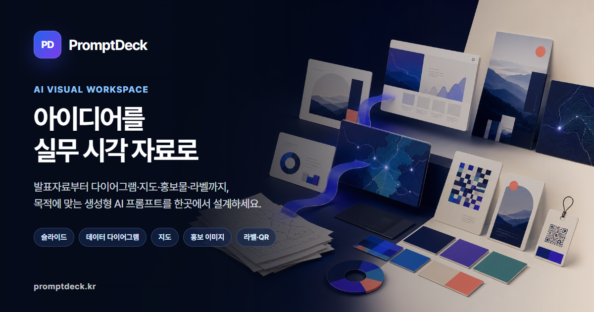

# PromptDeck

[](https://promptdeck.kr/)

PromptDeck은 발표자료와 실무 시각 자료를 위한 생성형 AI 프롬프트 설계 워크스페이스입니다. 슬라이드, 데이터 다이어그램, 지도, 홍보 이미지, 양식 이미지, 라벨·티켓, QR 작업을 목적과 형식에 맞게 구조화할 수 있습니다.

## 바로 사용하기

- 서비스 소개: [https://promptdeck.kr/](https://promptdeck.kr/)
- 광고 없는 작업 도구: [https://promptdeck.kr/app](https://promptdeck.kr/app)
- 운영·콘텐츠 원칙: [https://promptdeck.kr/about](https://promptdeck.kr/about)
- 무료 실무 가이드: [https://promptdeck.kr/guides/](https://promptdeck.kr/guides/)
- AI 발표자료 프롬프트: [가이드 보기](https://promptdeck.kr/guides/ai-presentation-prompt)
- 데이터 다이어그램 프롬프트: [가이드 보기](https://promptdeck.kr/guides/data-diagram-prompt)
- 홍보 이미지 프롬프트: [가이드 보기](https://promptdeck.kr/guides/promotion-image-prompt)

## 주요 기능

- 슬라이드별 핵심 메시지와 시각 지시를 구조적으로 설계
- 긴 프롬프트를 슬라이드 단위로 분리하고 편집·복사
- 데이터 관계도, 프로세스, 지도 이미지용 프롬프트 작성
- 포스터, 카드뉴스, SNS 홍보 이미지 기획
- 문서 표지·간지·배경·안내판 및 양식 이미지 프롬프트 작성
- 라벨·티켓 레이아웃과 QR 코드 생성

## 로컬 실행과 검증

```bash
npm install
npm start
```

정적 배포본과 주요 기능은 다음 명령으로 검증합니다.

```bash
npm run build:static
npm run seo:test
npm run smoke:test
npm run static:test
```

## 이용 전 확인

생성형 AI 결과는 사실, 수치, 저작권, 개인정보를 사용자가 최종 검토해야 합니다. 공개 서비스의 세부 기준은 [AI 이용정책](https://promptdeck.kr/ai-policy), [저작권 정책](https://promptdeck.kr/copyright-policy), [개인정보처리방침](https://promptdeck.kr/privacy)에서 확인할 수 있습니다.
