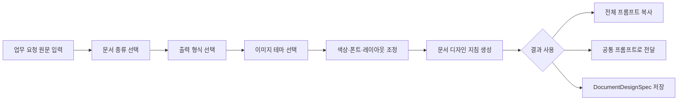

# PromptDeck 문서 디자인 프롬프트 탭 구현계획

- 문서 상태: 구현 제안 v1.0
- 작성일: 2026-09-06
- 제안 탭 이름: `문서 디자인`
- 제안 탭 키: `documentDesign`
- 핵심 결과물: 사용자 원문 뒤에 붙일 문서 디자인 지침과 구조화된 `DocumentDesignSpec`

## 1. 결정 요약

새 탭은 문서를 직접 생성하는 편집기가 아니라, 사용자의 업무 요청을 보존하면서 문서의 색상·폰트·레이아웃·표·차트·이미지 사용 규칙을 구체화하는 **문서 디자인 프롬프트 빌더**로 구현한다.

사용자는 먼저 `PPTX`, `DOCX`, `HWPX`, `PDF` 중 출력 형식을 고르고, 이미지 중심 테마 갤러리에서 원하는 디자인을 선택한다. 선택한 테마는 문서 형식에 맞는 규격으로 변환되며, 사용자는 색상·글꼴·정보 밀도·여백·표·차트·표지 등을 세부 조정할 수 있다. 최종 결과는 다음 순서를 유지한다.

1. 사용자가 입력한 원문 요청
2. 문서 디자인 규격
3. 출력·검수 규칙

`PDF`는 레이아웃 유형이 아니므로 `PDF 보고서`, `PDF 발표자료`처럼 문서 종류와 출력 형식을 분리한다. 예를 들어 문서 종류는 `보고서`, 출력 형식은 `PDF`로 선택한다.

## 2. 문제 정의

사용자가 문서 작성을 요청할 때 내용, 대상, 분량은 설명하지만 색상 역할, 한글 글꼴 조합, 페이지 구조, 표·차트 규칙, 여백과 정보 밀도는 빠뜨리는 경우가 많다. 그 결과 AI가 만든 문서는 내용이 맞더라도 화면과 인쇄에서 위계가 약하고, 페이지마다 디자인이 달라지며, 공공기관·업무 문서에 필요한 표와 근거 표현이 불안정해진다.

기존 PromptDeck에는 204개 슬라이드 스타일과 색상·타이포그래피·구성 계약이 있지만 슬라이드 이미지 중심이다. 새 탭은 이 디자인 DNA를 재사용하되 문서 형식별 크기, 글꼴 크기, 여백, 표와 페이지 흐름을 담당하는 별도 변환 계층을 둔다.

## 3. 목표

| 목표 | 완료 기준 |
|---|---|
| 원문 요구사항 보존 | 최종 결과에서 사용자 원문이 한 글자도 임의 변경되지 않는다. |
| 빠른 디자인 선택 | 샘플 입력 기준 60초 안에 테마 선택부터 전체 프롬프트 복사까지 완료한다. |
| 형식별 실효성 | 같은 테마라도 PPTX와 A4 보고서에서 서로 다른 크기·여백·본문 규칙이 출력된다. |
| 디자인 일관성 | 표지, 목차, 본문, 표, 차트, 결론 페이지가 동일한 색상 역할과 타이포 위계를 공유한다. |
| 검증 가능성 | 구조화된 JSON 규격과 사람이 읽을 수 있는 디자인 지침을 함께 생성한다. |
| 모바일 사용성 | 390px 화면에서 테마 선택, 세부 조정, 결과 복사가 가로 넘침 없이 작동한다. |

## 4. v1 범위

### P0: 첫 배포 필수

- `문서 디자인` 탭과 독립 pane 추가
- 업무 요청 원문 입력
- 문서 종류와 출력 형식 분리 선택
- 문서 전용 테마 12개와 테마별 실제 이미지 미리보기 3종
- 색상·폰트·레이아웃·표·차트·이미지·표지 세부 조정
- 디자인 지침 생성, 전체 프롬프트 복사, 공통 프롬프트 탭으로 전달
- 선택 상태 자동 저장과 초기화
- `DocumentDesignSpec 1.0` JSON 생성·다운로드
- 데스크톱과 모바일 회귀 검사

### P1: 첫 배포 후 확장

- 사용자 정의 테마 저장·불러오기
- 기관 CI 색상과 로고 규칙 등록
- 테마 24개로 확장
- 두 테마 비교 보기
- DOCX/HWPX/PPTX 생성 스킬에 구조화 규격 전달
- 최근 사용 테마와 즐겨찾기

### P2: 후속 검토

- 사용자가 올린 기존 문서에서 색상·폰트·레이아웃 추출
- 실제 DOCX/HWPX/PPTX 파일 즉시 생성
- 조직 단위 테마 공유와 버전 관리
- 템플릿 승인·배포·폐기 이력

## 5. v1 비범위

- 브라우저 안에서 워드·한글·파워포인트를 완전히 대체하는 편집기
- 선택한 글꼴 파일의 자동 구매나 배포
- 출처 없는 기관 로고와 브랜드 색상의 자동 생성
- PDF라는 이유만으로 문서 종류를 자동 결정하는 기능
- 기존 204개 슬라이드 스타일을 가공 없이 전부 노출하는 갤러리

## 6. 핵심 사용자 흐름



## 7. 탭 화면 구조

### 데스크톱

```text
┌────────────────────────────────────────────────────────────────────┐
│ 문서 디자인                                                       │
│ 업무 요청 + 문서 디자인 규격을 하나의 실행 프롬프트로 만듭니다.  │
├──────────────────────────────────┬─────────────────────────────────┤
│ 1. 문서 목적과 형식             │ 핵심 액션                       │
│    원문 요청                     │ [지침 생성] [전체 복사] [전달] │
│    문서 종류 / 출력 형식         ├─────────────────────────────────┤
│                                  │ 선택 요약                       │
│ 2. 이미지 테마 갤러리           │ 테마·팔레트·폰트·레이아웃       │
│    [표지 이미지] [본문] [표·차트]├─────────────────────────────────┤
│                                  │ 실시간 문서 미리보기            │
│ 3. 세부 조정                     │ 표지 / 본문 / 데이터 보기 전환  │
│    색상·폰트·레이아웃·요소       ├─────────────────────────────────┤
│                                  │ 생성된 디자인 지침              │
│ 4. 출력·검수 옵션               │ 원문 + 디자인 지침              │
└──────────────────────────────────┴─────────────────────────────────┘
```

왼쪽은 입력과 선택, 오른쪽은 결과와 미리보기로 나눈다. `#tabActions`는 `.doc-design-result-stack` 최상단에 배치한다. 직접 노출할 액션은 세 개로 제한한다.

- `디자인 지침 생성`
- `전체 프롬프트 복사`
- `공통 프롬프트로 보내기`

`JSON 다운로드`, `샘플 채우기`, `초기화`는 더보기 메뉴에 둔다.

### 모바일

- 단계형 아코디언을 사용하고 한 번에 한 단계만 연다.
- 테마 카드는 가로 스크롤 대신 2열 그리드로 표시한다.
- 선택된 테마 요약과 결과는 입력 단계 다음에 이어지는 단일 세로 스크롤로 구성한다.
- 하단 핵심 액션은 `전체 프롬프트 복사` 한 개로 제공한다. 결과가 오래된 상태라면 복사 전에 자동 재생성한다.

## 8. 문서 종류와 출력 형식

### 문서 종류

| 값 | 적용 규칙 |
|---|---|
| 업무보고서 | 결론·근거·조치사항 중심, 표와 요약 박스 우선 |
| 사업계획서 | 문제·목표·전략·일정·예산·성과지표 흐름 |
| 제안서 | 고객 문제·해결안·차별성·수행계획·기대효과 흐름 |
| 정책·연구보고서 | 근거·방법·분석·시사점·출처 체계 강화 |
| 발표자료 | 슬라이드당 핵심 메시지 하나, 16:9 시각 위계 |
| 매뉴얼·가이드 | 순서·화면·주의사항·체크리스트 중심 |
| 회의·결과자료 | 안건·논의·결정·담당·기한 중심 |

### 출력 형식

- `PPTX`
- `DOCX`
- `HWPX`
- `PDF`
- `화면용 HTML`

### 형식별 기본 규칙

| 형식 | 기본 크기 | 핵심 제약 |
|---|---|---|
| PPTX | 16:9 | 제목 28pt 이상, 본문 16pt 이상, 한 장 한 메시지 |
| DOCX | A4 세로 | 인쇄 여백, 문단 간격, 표 반복 머리행, 페이지 나눔 |
| HWPX | A4 세로 | 한글 문서용 문단·표 구조, 공공기관 출력 안정성 |
| PDF | 문서 종류에서 상속 | 최종 크기, 포함 글꼴, 링크, 페이지 잘림 검수 |
| HTML | 반응형 화면 | 접근성 대비, 모바일 재배치, 인쇄 스타일 분리 |

수치는 테마와 정보 밀도에 따라 조정할 수 있지만, 인쇄·가독성 하한은 유지한다.

## 9. 문서 전용 테마 카탈로그

v1에서는 아래 12개를 제공한다. 기존 슬라이드 카탈로그에서 디자인 DNA를 참조하지만 문서 구조와 프롬프트는 별도로 관리한다.

| ID | 이름 | 주요 용도 | 시각 특징 |
|---|---|---|---|
| `public-brief` | 공공기관 보고 | 업무보고·결과보고 | 청색 역할색, 명조형 제목, 표 중심 |
| `executive-summary` | 경영진 요약 | 임원보고·의사결정 | 결론 우선, 네이비, 핵심 수치 강조 |
| `consulting-strategy` | 컨설팅 전략 | 전략·진단·로드맵 | 논리 그리드, 비교표, 절제된 강조색 |
| `proposal-win` | 제안·입찰 | 제안서·사업계획 | 설득 흐름, 강한 장표 제목, 증거 카드 |
| `research-policy` | 연구·정책 | 연구·정책보고 | 차분한 색, 출처·각주·도표 체계 |
| `technology-industry` | 기술·산업 | 기술보고·사업화 | 기술 도식, 냉색 팔레트, 구조선 |
| `data-evidence` | 데이터 중심 | 통계·성과·평가 | 표·차트 우선, 수치 대비, 주석 체계 |
| `minimal-office` | 미니멀 실무 | 일반 보고·매뉴얼 | 넓은 여백, 얇은 구분선, 중립색 |
| `editorial-premium` | 에디토리얼 | 백서·브랜드북 | 큰 타이포, 비대칭 여백, 사진 중심 |
| `education-guide` | 교육·안내 | 교재·가이드 | 단계 번호, 예시·주의 박스, 친근한 색 |
| `warm-human` | 휴먼 커뮤니케이션 | 복지·지역·인재 | 따뜻한 중간색, 사람 사진, 부드러운 형태 |
| `dark-innovation` | 다크 이노베이션 | 기술 발표·비전 | 어두운 배경, 고대비 포인트, 빛의 깊이 |

### 이미지 미리보기 규격

테마마다 아래 세 이미지를 준비한다.

- `cover.png`: 표지 또는 첫 슬라이드
- `content.png`: 본문, 목차, 섹션 구조
- `data.png`: 표, 차트, 핵심 수치 표현

파일 경로는 `assets/document-design-previews/<theme-id>-<view>.png`를 사용한다. 960×540px 무손실 PNG와 동일한 샘플 내용을 사용해 테마 차이를 비교할 수 있게 한다. 갤러리 이미지는 지연 로딩하고, 상세 패널은 선택값을 반영하는 실시간 문서 모형으로 렌더링한다.

## 10. 세부 조정 항목

### 색상

- 주조색, 보조색, 강조색
- 배경색, 표면색, 본문색, 보조 본문색, 구분선색
- 표 머리행과 차트 계열색
- 밝은 모드·어두운 모드
- 텍스트와 배경 대비 자동 검사
- `추천값 복구`

색상 이름만 출력하지 않고 HEX 값과 사용 역할을 함께 출력한다. 예: `#12315B는 제목과 표 머리행`, `#00A0A8은 핵심 수치와 진행 상태`.

### 폰트

- 제목 글꼴과 본문 글꼴 분리
- 한글·영문·숫자 대체 글꼴
- 제목 굵기, 본문 굵기, 숫자 굵기
- 제목·본문·각주 크기
- 행간, 문단 간격, 자간
- 표 안쪽 글자 크기와 숫자 정렬

v1 기본 프리셋은 `공공 명조+고딕`, `현대 고딕`, `편집 명조`, `데이터 고딕`, `브랜드 타이포`로 제한한다. 실제 문서 생성 환경에 글꼴이 없을 때 사용할 대체 글꼴을 항상 함께 명시한다.

### 레이아웃

- 용지·화면 크기와 방향
- 페이지 여백과 안전 영역
- 1단·2단·모듈 그리드
- 정보 밀도: 여유·표준·조밀
- 제목 위치와 본문 정렬
- 표지, 목차, 섹션 간지, 본문, 부록 사용 여부
- 헤더, 푸터, 페이지 번호, 문서번호, 보안등급
- 카드형·구분선형·무테형 컨테이너

### 표·차트·이미지

- 표 머리행 색상, 줄무늬, 합계행, 반복 머리행
- 차트 색상 순서와 강조 데이터 규칙
- 축·범례·단위·출처 위치
- 사진·일러스트·아이콘 사용 수준
- 이미지와 텍스트 비율
- 캡션, 그림 번호, 대체 텍스트

### 출력·검수

- A4 인쇄 시 잘림 방지
- PPT 화면 투사 가독성
- PDF 글꼴 포함과 링크 유지
- 표의 페이지 분할과 반복 머리행
- 대비·최소 글자 크기·색상만으로 의미 전달 금지
- 제공되지 않은 로고·수치·출처 생성 금지

## 11. 프롬프트 출력 계약

최종 복사 결과는 원문을 먼저 두고 디자인 규격을 뒤에 추가한다.

```text
[사용자 요청 원문]
월간 사업성과 보고서를 A4 8쪽으로 작성해줘. 핵심성과와 다음 달 계획을 포함해줘.

[DOCUMENT DESIGN SPECIFICATION v1.0]
적용 범위: 내용과 사실을 변경하지 않고 시각 디자인과 문서 구조에만 적용한다.
문서 종류: 업무보고서
출력 형식: HWPX 및 PDF
테마: 공공기관 보고

색상 시스템
- 제목·표 머리행: #17365D
- 핵심 수치·강조: #2F75B5
- 배경: #FFFFFF
- 본문: #1F2937

타이포그래피
- 제목: 본명조 계열, 대체 글꼴 Noto Serif KR, 22pt, Bold
- 본문: 본고딕 계열, 대체 글꼴 Noto Sans KR, 10.5pt, Regular
- 행간 160%, 표 본문 9pt 이상

레이아웃
- A4 세로, 상하 18mm·좌우 20mm 여백
- 표지 → 1쪽 요약 → 본문 → 다음 달 계획 순서
- 본문은 1단 그리드, 표와 핵심 수치는 같은 기준선에 정렬

표·차트
- 표 머리행은 주조색 바탕에 흰색 글자
- 수치는 오른쪽 정렬하고 단위를 머리행에 표시
- 모든 차트에 제목·단위·출처를 표시

검수
- 제공되지 않은 수치, 날짜, 기관명, 로고를 생성하지 않는다.
- A4 인쇄에서 표·문단·페이지 번호가 잘리지 않게 최종 PDF를 확인한다.
- 위 규격의 항목명이나 설계 메타데이터를 문서 본문에 그대로 노출하지 않는다.
```

## 12. 구조화 데이터 계약

```json
{
  "schema": "promptdeck-document-design/1.0",
  "sourcePrompt": "사용자가 입력한 원문",
  "document": {
    "kind": "business-report",
    "formats": ["hwpx", "pdf"],
    "pageProfile": "a4-portrait",
    "language": "ko-KR"
  },
  "theme": {
    "id": "public-brief",
    "catalogVersion": 1,
    "sourceVisualStyleId": "minimal-report"
  },
  "tokens": {
    "colors": {
      "primary": "#17365D",
      "secondary": "#5B7796",
      "accent": "#2F75B5",
      "background": "#FFFFFF",
      "surface": "#F4F7FA",
      "textPrimary": "#1F2937",
      "textSecondary": "#667085",
      "border": "#D7DEE8"
    },
    "typography": {
      "headingFamily": "본명조",
      "bodyFamily": "본고딕",
      "headingFallback": "Noto Serif KR",
      "bodyFallback": "Noto Sans KR",
      "bodySizePt": 10.5,
      "lineHeightPercent": 160
    },
    "spacing": {
      "marginTopMm": 18,
      "marginRightMm": 20,
      "marginBottomMm": 18,
      "marginLeftMm": 20
    }
  },
  "layout": {
    "grid": "single-column",
    "density": "standard",
    "cover": true,
    "toc": false,
    "sectionDividers": true,
    "header": "minimal",
    "footer": "page-number"
  },
  "components": {
    "table": "official-header",
    "chart": "evidence-first",
    "callout": "left-accent",
    "imagePolicy": "evidence-only"
  },
  "quality": {
    "preserveFacts": true,
    "inventMissingData": false,
    "renderMetadata": false,
    "verifyPrintLayout": true
  }
}
```

원문과 디자인 규격은 별도 필드로 보관한다. 화면에서 원문을 수정하지 않으며, 최종 복사 시에만 두 블록을 결합한다.

## 13. 기존 코드와의 연결

### 새 파일

| 파일 | 역할 |
|---|---|
| `src/document-design-catalog.js` | 문서 전용 테마 12개와 형식별 변환값 |
| `src/document-design-contract.js` | 스키마 정규화, 검증, 프롬프트 렌더링 |
| `src/document-design.js` | 탭 상태, 갤러리, 세부 조정, 복사·전달 |
| `styles/document-design.css` | 데스크톱·모바일 UI와 미리보기 |
| `scripts/document-design-smoke-test.mjs` | 계약·프롬프트·미리보기 회귀 검사 |
| `assets/document-design-previews/*` | 테마별 표지·본문·데이터 이미지 |

### 수정 파일

| 파일 | 변경 내용 |
|---|---|
| `index.html` | `tabBtnDocumentDesign`, `paneDocumentDesign`, CSS·JS 로딩 추가 |
| `src/tabs.js` | `documentDesign` 탭, 액션 도크, 모바일 핵심 액션 등록 |
| `scripts/smoke-test.mjs` | 탭 표시·전환·모바일·복사 흐름 검사 |
| `scripts/deploy-static-release.mjs` | `document-design:test`를 공식 릴리스 검사에 추가 |
| `scripts/guides-smoke-test.mjs` | 기능 가이드 추가 시 링크·반응형 검사 |

### 탭 등록안

```js
documentDesign: {
  button: document.getElementById("tabBtnDocumentDesign"),
  pane: document.getElementById("paneDocumentDesign"),
  group: "deck",
  actions: "documentDesign",
  actionHost: ".doc-design-result-stack",
  stickyActionPanel: false,
}
```

상단 위치는 `공통 프롬프트` 다음, `슬라이드 분리기` 앞을 권장한다. 기존 슬라이드 작업과 구분하면서 문서 설계가 프롬프트 작성의 시작점이라는 의미를 유지한다.

## 14. 카탈로그 재사용 전략

기존 `PromptDeckSlideStyleCatalog`는 그대로 유지한다. 문서 테마에는 `sourceVisualStyleId`를 두어 색상, 표면, 타이포그래피 성격을 참조한다. 다음 값은 문서용 어댑터에서 새로 정의한다.

- A4·16:9별 글자 크기
- 페이지 여백과 문단 간격
- 표지·목차·섹션·본문·부록 구조
- 표 머리행, 반복 머리행, 합계행 규칙
- 차트 단위·범례·출처 규칙
- 페이지 번호와 헤더·푸터
- 인쇄·PDF 검수 규칙

이 방식이면 기존 슬라이드 스타일을 수정해 문서 탭이 깨지는 문제를 줄이고, 공통 색상·형태 언어는 계속 공유할 수 있다.

## 15. 상태와 저장

- 로컬 저장 키: `promptdeck.documentDesign.v1`
- 원문 요청, 선택 테마, 출력 형식, 세부 조정값을 저장한다.
- 사용자가 `초기화`를 누르기 전까지 마지막 작업을 복원한다.
- JSON 가져오기에서는 스키마와 값 범위를 검증하고 알 수 없는 키를 제거한다.
- 사용자가 선택한 사용자 정의 색상과 글꼴은 문서 지침에만 포함하며 글꼴 파일이나 개인정보를 저장하지 않는다.

## 16. 접근성과 반응형 기준

- 테마 갤러리는 `radiogroup`과 키보드 방향키 선택을 지원한다.
- 이미지에는 테마 이름과 주요 특징을 설명하는 대체 텍스트를 제공한다.
- 선택 상태를 색상만으로 표시하지 않고 체크 아이콘과 테두리를 함께 사용한다.
- 본문 대비 4.5:1 미만인 팔레트는 저장 전에 경고한다.
- 모든 버튼은 모바일에서 최소 44px 높이를 유지한다.
- 390px, 375px, 844×390에서 가로 스크롤과 하단 액션 가림이 없어야 한다.
- `prefers-reduced-motion`에서는 갤러리 전환 애니메이션을 줄인다.

## 17. 오류와 경계 조건

| 상황 | 동작 |
|---|---|
| 원문이 비어 있음 | 샘플 채우기와 입력 위치를 안내하고 생성하지 않는다. |
| PDF만 선택하고 문서 종류를 고르지 않음 | PDF 레이아웃을 임의 결정하지 않고 문서 종류 선택을 요청한다. |
| 글꼴명이 비어 있음 | 선택 테마의 한글 기본 글꼴과 대체 글꼴을 복원한다. |
| 대비가 낮은 색상 조합 | 경고와 자동 보정안을 표시하되 사용자의 색상을 몰래 변경하지 않는다. |
| 지나치게 긴 디자인 지침 | 표준 모드에서 1,800자 이내로 요약하고 JSON에는 전체 규격을 유지한다. |
| 사용자가 정확한 기존 양식을 요구함 | 테마보다 원본 양식과 명시적 치수 요구를 우선한다. |
| AI가 설계 메타데이터를 문서에 출력함 | `renderMetadata: false`와 비노출 문장을 마지막 검수 규칙에 포함한다. |

## 18. 테스트 계획

### 단위·계약 검사

- 12개 테마의 ID, 이름, 색상 역할, 폰트 대체값 존재
- 색상 HEX와 대비 검사
- PPTX·DOCX·HWPX·PDF별 필수 규칙 출력
- 사용자 원문 보존
- 표준 디자인 지침 1,800자 이하
- `renderMetadata: false`, `preserveFacts: true` 유지
- 스키마 내보내기·가져오기 왕복 일치

### 브라우저 검사

- 상단 탭 버튼과 pane 연결
- `#tabActions`가 결과 패널 최상단에 배치
- 12개 테마 이미지 로딩과 선택
- 표지·본문·표·차트 미리보기 전환
- 색상·폰트·밀도 조정 즉시 반영
- 전체 프롬프트 복사와 공통 프롬프트 전달
- 로컬 저장 후 새로고침 복원
- 다크모드와 키보드 탐색
- 모바일 단계 전환과 하단 액션

### 시각 검수

- 12개 테마 × 표지·본문·데이터 이미지 36장 육안 검수
- PPT 16:9와 A4 보고서에서 같은 테마의 디자인 DNA 유지
- 한글 줄바꿈, 표 머리행, 숫자 정렬, 각주 가독성 확인
- 모바일 카드 텍스트와 이미지 잘림 확인

## 19. 완료 조건

- [ ] 탭 버튼, pane, CSS, JS, `tabs.js` 등록이 모두 존재한다.
- [ ] 12개 문서 테마와 36개 미리보기 이미지가 검증된다.
- [ ] 네 가지 핵심 출력 형식이 서로 다른 레이아웃 규칙을 생성한다.
- [ ] 사용자의 원문 요청이 최종 결과에서 변경되지 않는다.
- [ ] 색상·폰트·레이아웃·표·차트 세부 조정이 프롬프트와 JSON에 반영된다.
- [ ] 전체 프롬프트 복사와 공통 프롬프트 전달이 작동한다.
- [ ] 데스크톱·모바일·다크모드·키보드 검사가 통과한다.
- [ ] 정적 빌드와 공식 릴리스 검사가 통과한다.
- [ ] 운영·불변 URL에서 신규 JS·CSS·이미지 해시와 실제 탭 동작을 확인한다.

## 20. 구현 순서와 예상 공수

| 단계 | 범위 | 예상 |
|---|---|---:|
| 1 | 계약·카탈로그·프롬프트 출력기 | 1.5~2일 |
| 2 | 탭 HTML·CSS·반응형 화면 | 2~3일 |
| 3 | 테마 이미지 36장 제작·검수 | 2~3일 |
| 4 | 세부 조정·저장·복사·탭 전달 | 2~3일 |
| 5 | 자동 테스트·시각 검수·가이드 | 1.5~2일 |
| 6 | 정적 릴리스·운영 검증 | 0.5일 |

총 예상은 9.5~13.5 개발일이다. v1을 8개 테마와 핵심 조정만으로 줄이면 약 6~8일에 첫 배포가 가능하다.

## 21. 권장 착수안

첫 구현은 12개 테마 전체를 한 번에 만들기보다 아래 세로 기능을 완성하는 방식으로 진행한다.

1. `공공기관 보고`, `경영진 요약`, `제안·입찰` 3개 테마로 계약과 화면을 완성한다.
2. PPTX·HWPX·PDF의 형식별 출력 차이를 검증한다.
3. 원문 보존, 디자인 지침, JSON, 공통 프롬프트 전달을 통합한다.
4. 구조가 확정되면 나머지 9개 테마와 27개 미리보기 이미지를 확장한다.

이 순서로 진행하면 갤러리 이미지를 대량 제작하기 전에 데이터 구조와 실제 문서 생성 효과를 검증할 수 있다.
