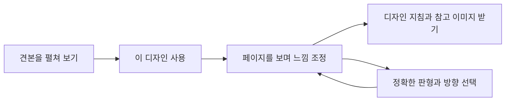
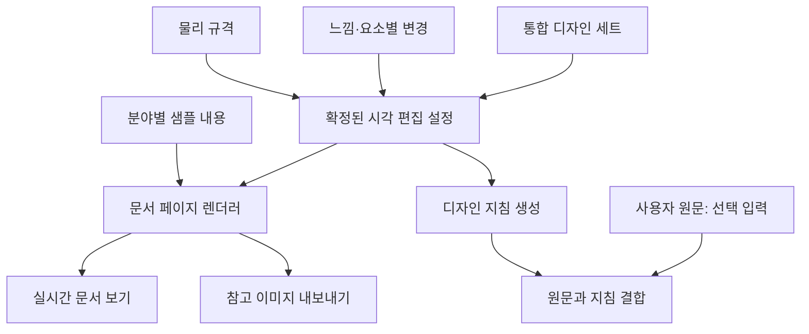

# PromptDeck 문서 디자인 — 견본 선택·실시간 조정 개발계획서

| 항목 | 내용 |
|---|---|
| 작성일 | 2026-09-08 |
| 문서 버전 | 1.0 |
| 상태 | P0 로컬 구현·검증 완료. 결과는 [구현·검증 문서](document-design-workbench-implementation-2026-09-08.md)에서 확인한다. 아래는 승인된 범위와 목표를 정의한 원본 계획이다. |
| 대상 | 기존 `문서 디자인` 탭 |
| 제품 목표 | 완성된 문서 견본을 직접 비교하고, 화면을 보며 원하는 느낌으로 다듬은 뒤 디자인 지침과 참고 이미지를 받는다. |
| 1차 검증 범위 | 보고서·학습 교재·산문집, 분야별 2개 디자인, 총 6세트 |
| 첫 정식 출시 범위 | 6개 분야 × 2개 디자인, 총 12세트 |
| 기능 경계 | 문서 내용은 별도 데이터 또는 사용자 요청으로 제공된다. 본 기능은 시각 편집과 제작 규격을 정의한다. |

## 1. 개발 결론

사용자 흐름은 **견본 선택 → 보면서 조정 → 디자인 받기**로 고정한다. 사용자가 템플릿·변형·테마를 따로 이해하거나 여러 단계에서 조합할 필요가 없도록, 색상·서체·배경·페이지 배치·표·이미지 표현이 완성된 하나의 디자인 세트를 제공한다.

핵심 개발 대상은 설정값에 따라 문서의 실제 화면이 변하는 미리보기다. 미리보기, 참고 이미지, 디자인 지침은 동일한 설정을 사용한다. 고정 이미지 수량보다 이 세 결과의 일치 여부를 먼저 검증한다.

첫 정식 출시의 필수 결과물은 다음 다섯 가지다.

1. 구조와 분위기가 구별되는 문서 디자인 12세트.
2. 세트별 5~7개 대표 페이지를 읽고 확대할 수 있는 문서 보기.
3. 색상·여백·이미지·제목·장식 조정의 실시간 반영.
4. 원문을 보존하는 디자인 지침과 조정 결과를 반영한 참고 이미지 다운로드.
5. 데스크톱·모바일 동작, 저장 복원, 내보내기, 운영 자산 검증.

## 2. 이전 계획에서 변경하는 사항

본 문서는 `document-type-template-enhancement-plan-2026-09-07.md`의 신규 개발 범위와 순서를 대체한다. 이전 문서의 35개 유형 분류는 후속 확장 자료로 사용한다.

| 이전 계획 | 이번 개발 기준 |
|---|---|
| 35개 유형을 먼저 모두 구축 | 대표 3개 분야에서 경험을 검증하고 6개 분야로 확장 |
| 유형 → 템플릿 → 변형 → 테마를 차례로 선택 | 완성된 디자인 세트를 한 번 선택 |
| 모든 유형에 동일한 6종 페이지 강제 | 분야에 필요한 5~7개 페이지를 개별 구성 |
| 210개 고정 미리보기 이미지 제작 우선 | 실제 문서 요소를 렌더링하고 고정 썸네일은 여기서 파생 |
| 규격에 따라 이미지 바깥 틀 변경 | 판형 비율과 내부 레이아웃을 함께 재계산 |
| 설정 설명과 이미지 연결 | 동일한 설정으로 화면·지침·다운로드 결과 생성 |

## 3. 현재 코드에서 확인한 출발점

2026-09-08 로컬 소스 확인 기준이다. 운영 사이트의 현재 배포 상태를 다시 검사한 결과는 아니다.

| 확인 사항 | 현재 상태 | 개발 조치 |
|---|---|---|
| 유형 데이터 | 35개 항목이 이름·용도·시각 문법 연결 중심 | 사용자는 6개 분야로 탐색; 상세 유형은 내부 확장 정보로 보존 |
| 디자인 자산 | 12개 테마 × 6개 고정 이미지 | 새 세트의 렌더링 결과에서 썸네일 생성 |
| 미리보기 | `previewMarkup()`이 고정 PNG를 표시 | 실제 텍스트·표·이미지 요소를 구성하는 렌더러로 교체 |
| 느낌 반영 | 외부 CSS 변수는 바뀌지만 PNG 내부는 고정 | 변수와 레이아웃 값이 실제 페이지 요소에 반영되도록 연결 |
| 페이지 역할 | 계약과 UI에 6개 역할이 고정 | 선택한 세트의 `pages` 배열에서 화면과 지침 생성 |
| 원문 입력 | 지침만 받는 경우에도 생성 시 빈 원문 오류 발생 | 디자인 단독 모드에서는 원문 없이 완료 가능 |
| 저장 | `promptdeck.documentDesign.v1` | 구버전을 보존하며 새 상태로 이전 |
| 결과 | 프롬프트, JSON, 공통 프롬프트 전달 | 조정된 참고 이미지와 묶음 다운로드 추가 |

주요 확인 파일: `src/document-design.js`, `src/document-design-catalog.js`, `src/document-design-contract.js`, `styles/document-design.css`.

## 4. 사용자와 성공 조건

| 사용자 | 하려는 일 | 성공한 상태 |
|---|---|---|
| 업무 문서 작성자 | 보고서·기획서의 완성된 형태를 골라 AI에 전달 | 표지부터 본문·표까지 같은 디자인으로 연결되는 견본을 선택 |
| 교육 자료 작성자 | 교재·수험서의 글·그림·문제 배치를 비교 | 개념 페이지와 활동·해설 페이지의 차이를 눈으로 확인 |
| 출판물 작성자 | 산문·동화의 판면과 이미지 분위기를 결정 | 긴 읽기와 장면 펼침을 보고 원하는 호흡을 선택 |
| 모바일 사용자 | 작은 화면에서 선택부터 다운로드까지 완료 | 전체 페이지 보기와 조정창을 번갈아 사용하며 상태를 유지 |

성공 기준은 사용성 테스트의 목표이며 기존 측정값이 아니다.

- 처음 보는 사용자 5명 중 4명이 도움 없이 견본 선택·느낌 변경·지침 받기를 완료한다.
- 위 과제의 완료 시간 중앙값을 3분 이내로 한다.
- 5명 중 4명이 같은 분야의 두 디자인 차이를 2가지 이상 설명한다.
- 공개된 모든 조정 항목은 변화가 보이는 페이지와 지침 항목을 가진다.
- 샘플 내용이 사용자 프롬프트에 유입되거나 원문이 변형되는 사례는 0건이어야 한다.

## 5. 출시 범위와 우선순위

| 우선순위 | 항목 | 완료 기준 |
|---|---|---|
| P0 | 12개 통합 디자인 세트 | 아래 카탈로그를 모두 제공하고 시각 검수를 통과 |
| P0 | 큰 페이지 미리보기·축소판 탐색 | 표지·본문·특수면을 직접 선택하고 확대 가능 |
| P0 | 핵심 느낌 5개 | 각 항목의 최소·중간·최대 선택이 화면과 지침에 반영 |
| P0 | 요소별 조정 | 색상, 서체 적용 범위, 표·차트·이미지 표현을 관련 페이지에서 조정 |
| P0 | 정확한 규격 | A4 세로 기본, 크기·방향 변경 시 실제 비율과 배치 반영 |
| P0 | 원문 없이 디자인 받기 | 디자인 지침 복사와 참고 이미지 저장이 원문 없이 동작 |
| P0 | 최신 결과 내보내기 | 현재 설정의 지침·PNG·JSON을 같은 묶음으로 저장 |
| P0 | 자동 저장·복원 | 새로고침과 구버전 이전 후 지원하는 선택값 유지 |
| P0 | 모바일·접근성 | 작은 화면·터치·키보드로 핵심 흐름 완료 |
| P1 | 두 세트 나란히 비교 | 같은 샘플·판형으로 차이를 비교 |
| P1 | 즐겨찾기·나만의 디자인 | 선택한 세트와 변경값을 이름을 붙여 저장 |
| P1 | 35개 상세 유형 확장 | 기존 12세트와 실제 차이를 검증한 신규 견본부터 추가 |
| P2 | 참고 문서의 디자인 분석 | 업로드 자료에서 시각 특징을 추출해 제안 |
| P2 | 최종 DOCX·PPTX·HWPX 생성 연동 | 별도 제작·렌더링 검증 체계와 연결 |

초기 범위에는 본문 작성·요약·목차 편집, 자유로운 드래그 편집기, 계정·서버 저장, 책등 폭 자동 계산을 포함하지 않는다. 입력 내용에 대한 최종 문서 파일 생성은 별도 기능이다.

## 6. 디자인 세트 12개

각 세트는 아래 페이지를 모두 포함한 완성된 견본이다. 같은 분야의 두 세트는 동일한 샘플 데이터를 사용하며, 색상 외에 제목 체계·판면·이미지 배치 중 두 가지 이상이 구별되어야 한다.

| 분야 | 세트 A | 세트 B | 대표 페이지 | 세트당 수 |
|---|---|---|---|---:|
| 보고서 | 정갈한 공공 보고 | 선명한 데이터 보고 | 표지, 장 시작, 본문, 비교표, 성과 차트, 근거 사진·주석 | 6 |
| 기획·제안서 | 단정한 전략 기획 | 이미지로 설득하는 제안 | 표지, 핵심 메시지, 전략 도식, 로드맵, 예산·일정표, 사례·근거 | 6 |
| 학습 교재 | 차근차근 개념 학습 | 그림으로 이해하는 학습 | 표지, 단원 도입, 개념 본문, 그림 설명, 예제, 활동·정리 | 6 |
| 수험서 | 이론·해설 집중 | 문제·실전 집중 | 표지, 단원 구분, 핵심 이론, 문제·선택지, 자료 문제, 풀이·정답, 정답표 | 7 |
| 산문집 | 여백이 깊은 산문 | 사진과 함께 읽는 산문 | 표지, 장 시작, 긴 본문, 인용, 사진·짧은 글 | 5 |
| 동화책 | 따뜻한 수채 동화 | 또렷한 종이조형 동화 | 표지, 글과 그림, 대화 장면, 전면 그림, 왼쪽·오른쪽 펼침 | 6 |

- 합계: 12세트, 72개 대표 단면. 동화 펼침은 각각의 세트에서 마지막 두 단면을 좌우로 연결한다.
- 1차 검증: 보고서 12면 + 학습 교재 12면 + 산문집 10면 = 6세트, 34개 대표 단면.
- 2차 확장: 기획·제안서 12면 + 수험서 14면 + 동화책 12면 = 추가 6세트, 38개 대표 단면.
- 페이지 수는 견본의 종류 수다. 사용자의 최종 문서 분량이나 목차 순서를 강제하지 않는다.
- 산문집·동화책에는 데이터 표·차트 페이지를 기본 제공하지 않는다. 같은 디자인 안에서 필요한 표현만 제시한다.
- 각 세트에 색상 역할, 제목·본문·숫자 서체, 배경, 아이콘, 픽토그램, 사진·삽화 표현, 표·차트, 캡션 규칙을 함께 정의한다.

## 7. 사용자 화면과 동작

### 7.1 견본 선택

- 첫 진입 시 원문 입력창 대신 디자인 견본을 보여준다. 기본 분야는 보고서다.
- 분야 필터는 `보고서 / 기획·제안 / 학습 교재 / 수험서 / 산문집 / 동화책`으로 표시한다.
- 카드는 표지·본문·대표 특수면 3개와 짧은 디자인 이름을 보여준다.
- 카드를 누르면 해당 세트의 큰 미리보기와 페이지 축소판을 연다.
- 분야 필터 변경은 탐색만 바꾼다. `이 디자인 사용`을 눌렀을 때 현재 세트를 변경한다.
- 첫 진입 외에는 최근 선택한 세트와 조정값을 복원한다.

### 7.2 보면서 조정

- 데스크톱은 왼쪽 페이지 목록, 중앙 큰 페이지, 오른쪽 조정 패널로 구성한다.
- 처음에는 세트의 대표 본문을 보여주고 표지는 축소판에서 언제든 선택한다.
- 페이지 탐색은 순서를 변경하는 기능이 아니다. 사용자의 실제 목차를 편집하지 않는다.
- 상단에는 디자인 이름, 판형·방향, `기본값 복구`를 표시한다.
- 모바일은 한 페이지와 축소판을 보여주고 `느낌 조정`을 누르면 아래 조정창을 연다.
- 조정창은 절반 높이 상태에서 결과 일부를 볼 수 있고, 닫으면 전체 문서가 다시 보인다.
- 적용 대상 페이지에 해당 요소가 없으면 `이 페이지에는 표가 없습니다. 비교표 보기`와 같이 해당 페이지로 이동하는 액션을 제공한다.

### 7.3 디자인 받기

- 기본 액션은 `디자인 지침 복사`다. 원문 입력 없이 사용할 수 있다.
- `참고 이미지 저장`으로 현재 조정 상태의 페이지를 저장한다.
- `한 번에 받기`로 지침·참고 이미지·설정 파일을 ZIP으로 받는다.
- `작성 요청과 합치기`를 펼친 경우에만 기존 원문 입력창을 제공한다.
- 원문이 있으면 원문 그대로 + 구분 줄바꿈 + 디자인 지침 순서로 결합한다.
- 기존 공통 프롬프트 전달과 JSON 다운로드는 더보기에서 유지한다.



### 7.4 모바일·접근성 수용 기준

- 375×667, 390×844, 844×390에서 화면 바깥으로 본문이 넘치지 않는다.
- 기본 보기에서는 페이지 전체가 비율을 유지하며 들어간다. 확대 모드에서만 명시적으로 이동한다.
- 페이지 전환에 이전·다음 버튼을 제공하고 스와이프만 강제하지 않는다.
- 아래 조정창과 고정 액션은 브라우저 안전 영역과 가상 키보드를 고려한다.
- 닫기·뒤로 가기 후 원래 페이지, 스크롤, 키보드 초점을 복원한다.
- 주요 터치 대상은 최소 44×44 CSS px, 입력 글자 크기는 모바일 16px 이상을 목표로 한다.
- 문서의 고정된 판면은 화면 폭에 따라 축소한다. 본문을 모바일 웹처럼 재배치해 다른 디자인으로 보여주지 않는다.

## 8. 느낌 조정과 요소별 조정

### 8.1 처음 보이는 핵심 조정 5개

3단계 선택 버튼을 사용한다. 선택값은 정성적 식별자로 저장하고 사용자에게 점수나 퍼센트를 노출하지 않는다.

| 조정 | 표시 선택지 | 실제 미리보기의 변화 | AI에 전달할 의도 |
|---|---|---|---|
| 색의 존재감 | 차분하게 / 균형 있게 / 선명하게 | 유색 면적, 강조 대상, 색 대비 | 정보 위계를 유지하며 색의 강도를 조절 |
| 여백과 호흡 | 촘촘하게 / 편안하게 / 여유롭게 | 페이지 여백, 행간, 문단 간격 | 분량과 판형을 고려한 읽기 호흡 |
| 그림의 비중 | 글 중심 / 균형 있게 / 그림 중심 | 이미지 크기, 글·그림 분할, 캡션 배치 | 내용에 적합한 이미지 존재감 |
| 제목의 강조 | 담백하게 / 또렷하게 / 강하게 | 제목 크기감, 굵기, 주변 간격 | 제목과 본문 사이의 위계 차이 |
| 장식의 정도 | 최소한 / 적당히 / 풍부하게 | 배경, 아이콘, 픽토그램, 장식 모티프 | 디자인 언어를 유지하는 장식 수준 |

세트별로 변화량을 다르게 설계한다. 산문집의 `풍부하게`가 보고서형 카드나 큰 KPI 숫자를 추가하는 결과가 되어서는 안 된다.

### 8.2 필요한 때 여는 요소별 조정

| 요소 | 제공 설정 | 화면 반영 범위 |
|---|---|---|
| 색상 | 추천 배색 3종, 주색·강조색 직접 선택, 색의 사용 위치 | 제목·면·표·차트에 역할별 적용 |
| 서체 | 검증된 서체 조합, 적용 범위: 제목·본문·숫자·표·캡션·인용 | 해당 텍스트 요소만 변경 |
| 여백·위계 | 여백 균형, 단락 간격, 제목 단계의 대비 | 문단·제목·각주의 관계 |
| 표 | 가로선형 / 옅은 줄무늬형 / 무테형, 정보량·셀 여유 정도 | 기존 샘플 행·열을 삭제하지 않고 구조와 간격 변경 |
| 차트 | 비교 / 추세 / 구성비 목적에 맞는 형식, 강조·범례 정도 | 각 형식에 맞는 동일한 분야 샘플 데이터 사용 |
| 이미지·배경 | 사진·삽화 스타일, 배경 범위: 표지·장 시작·일부 본문 | 등록된 이미지와 배경의 배치·대비 변경 |
| 아이콘·픽토그램 | 사용 범위, 표현 세트, 강조 정도 | 의미가 정해진 안내·분류·절차 요소에만 사용 |
| 도식 | 흐름 / 관계 / 계층, 선·색 강조 정도 | 입력 관계를 보존하는 도식 표현 |

초기에는 구현된 페이지가 없는 설정을 노출하지 않는다. 지원하지 않는 조합은 이유와 가능한 대안을 알려주며 동작 없는 컨트롤을 남기지 않는다.

### 8.3 설정 충돌 방지

- 세트 기본값 → 핵심 느낌 변경 → 요소별 명시 변경 순서로 해석한다.
- 물리 규격은 별도로 유지하며 세트·느낌 변경이 크기·방향을 덮어쓰지 않는다.
- 요소별 변경이 핵심 조정에 우선하는 경우 `개별 조정 적용 중`을 표시한다.
- 핵심 조정을 다시 바꾸면 해당 항목의 상속값만 바꾼다. 개별 변경값을 조용히 삭제하지 않는다.
- `기본값 복구`는 현재 세트의 디자인 변경값을 해제한다. 원문과 물리 규격은 유지한다.
- 세트를 교체하면 새 세트 기본값을 적용하고 직전 설정을 한 번 되돌릴 수 있게 한다. 매 입력마다 별도 확인창을 띄우지 않는다.

## 9. 물리 규격과 미리보기 판면

- 기본값: A4, 세로형, 완성 크기 210×297mm.
- 첫 출시 지원: A4, A3, A5, B5(182×257mm), Letter, 각각 세로·가로.
- 기존 B5는 치수를 함께 표시해 크기를 명확히 한다.
- 세트의 권장 판형은 안내만 한다. 사용자가 고르기 전까지 A4 세로를 자동 변경하지 않는다.
- 출력 형식을 PPTX로 선택해도 판형을 자동으로 16:9로 변경하지 않는다.
- 판형 변경 시 너비·높이·그리드·줄바꿈을 재계산한다. 완성된 페이지를 화면에 맞출 때만 비율을 유지해 축소한다.
- 줄바꿈과 문단 수가 많은 샘플이 넘치면 같은 페이지 역할의 이어지는 화면을 사용한다. 내용을 자르거나 본문을 무제한 축소하지 않는다.
- 동화의 맞쪽은 완성 페이지 두 장을 연결해 표시한다. 각 페이지의 치수와 중앙 제본 영역을 구분한다.
- 제본·양면·도련 선택은 기존 정확값과 호환되게 유지한다. 책등 폭은 종이·매수 정보가 없으므로 자동 확정하지 않는다.
- 제작 지침의 mm 값은 고정 규격이며, 프롬프트의 정성적 조정 대상에 포함하지 않는다.

## 10. 미리보기 구현 방식

### 10.1 화면과 지침의 공통 설정



정성적 선택은 화면 렌더링을 위해 내부 수치로 해석한다. 예를 들어 `여유롭게`를 특정 간격으로 시각화하되, 해당 수치는 샘플 표시용이며 AI에 고정 여백·pt 지시로 전달하지 않는다.

### 10.2 실제 페이지 렌더링

- 기존 정적 HTML/CSS/JavaScript 구조에서 독립된 문서 렌더러를 추가한다.
- 제목·문단·표·캡션은 실제 DOM 요소로 구성한다. 사진·삽화는 실제 이미지 자산을 사용한다.
- 표·차트·도식은 공통 페이지 모델을 받아 렌더링한다. 기존 다이어그램 모듈은 독립 사용 가능한 부분만 재사용한다.
- 동적 미리보기 전체를 고정 PNG로 대체하지 않는다. 생성된 PNG는 목록 썸네일과 다운로드에 사용한다.
- 현재 큰 페이지와 인접 페이지를 우선 렌더링한다. 모든 세트의 전 페이지를 동시에 DOM에 만들지 않는다.
- 모바일용 확대 배율과 문서의 실제 레이아웃 계산을 분리한다.

### 10.3 샘플 내용

- 보고·기획·학습·수험·산문·동화에 각각 맞는 짧은 샘플 데이터를 작성한다.
- 같은 분야의 두 디자인은 같은 데이터와 같은 판형으로 비교한다.
- 미리보기 설명에 `디자인 견본 · 내용은 예시`를 표시한다.
- 샘플 문장·숫자·문제·정답은 디자인 프롬프트 생성기에 전달하지 않는다.
- 실제 사용자의 장문 내용에 대한 자동 페이지 편집은 첫 출시 범위가 아니다.
- 짧은 샘플과 긴 샘플 두 가지로 줄바꿈·표 넘침을 별도 검증한다.

### 10.4 이미지·서체 자산

- 디자인마다 이미지 조형, 색조, 배경 모티프, 아이콘 세트를 명시한 자산 목록을 작성한다.
- 기존 자산의 출처·사용 조건·용도를 확인해 재사용한다. 부족한 삽화는 승인된 세트 방향에 맞춰 제작한다.
- 동화는 같은 등장인물과 장면 맥락이 이어지는 삽화를 준비한다. 보고서 스타일 이미지를 동화 견본에 끼워 넣지 않는다.
- 기본 한글 서체는 표시와 참고 이미지 내보내기에 필요한 파일 및 사용 조건을 확보해 같은 출처에서 제공한다.
- `document.fonts.ready`와 이미지 디코딩 완료 후 렌더링 확정·캡처를 진행한다.
- 사용 불가능한 서체를 선택한 것처럼 보여주지 않는다. 대체 서체 사용 시 화면과 지침에 같은 대체 정보를 반영한다.

## 11. 디자인 지침과 다운로드

### 11.1 지침 원칙

`DocumentDesignSpec 3.0`은 다음 내용을 담는다.

1. 원문 내용·목차·문장·사실·수치를 보존하는 원칙.
2. 선택한 디자인 세트의 식별자·버전·분야.
3. 정확한 물리 규격과 출력 형식.
4. 해당 분야에 실제 존재하는 페이지 역할별 편집 규칙.
5. 색상 역할, 서체 적용 범위, 표·차트·이미지·배경·아이콘·픽토그램 규칙.
6. 사용자가 선택한 정성적 느낌.
7. 여러 페이지의 일관성 및 제작 환경별 검수 지침.

견본 페이지는 사용할 수 있는 시각 구성의 예시다. 자료에 없는 목차·차트·문제·요약문을 새로 만들라는 지시를 넣지 않는다. 지침의 항목명과 샘플 제목을 최종 문서 본문에 출력하도록 지시하지 않는다.

### 11.2 다운로드 구성

| 파일 | 내용 |
|---|---|
| `design-prompt.txt` | 현재 조정 결과의 디자인 지침 |
| `reference-sheet.png` | 표지·본문·대표 특수면을 모은 기본 3면 참고 이미지 |
| `pages/*.png` | 사용자가 선택한 페이지; 전체 받기 선택 시 세트 전체 |
| `design-spec.json` | 재사용 가능한 디자인 의미·물리 규격, 스키마·세트 버전 |
| `README.txt` | 원문 요청 + 디자인 지침 + 참고 이미지를 제작 AI에 전달하는 방법 |

- 기본 3면은 자동 선택하되 사용자가 다른 페이지로 바꿀 수 있다.
- 원문은 기본 디자인 묶음에 포함하지 않는다. `작성 요청 포함`을 선택한 경우에만 별도 파일로 넣는다.
- PNG는 디자인 참조용이다. 인쇄용 최종 문서 파일을 생성했다고 표시하지 않는다.
- 이미지의 샘플 문장·숫자를 실제 데이터로 복사하지 않도록 사용 안내와 지침에 명시한다.

### 11.3 브라우저 이미지 내보내기

- 구현 기준은 로컬 배포한 `html2canvas`로 페이지 DOM을 PNG로 변환하고, 기존 ZIP 작성 모듈의 호환성을 확인해 묶는 방식이다.
- 라이브러리는 캡처 버튼을 누를 때 지연 로딩한다. 최초 탐색에 필수 의존성을 추가하지 않는다.
- 문서 렌더러는 캡처 가능한 CSS로 작성한다. 그림자·필터·혼합 모드·`object-fit`에 핵심 표현을 의존하지 않는다.
- 편집 화면 바깥 UI는 캡처하지 않는다. 전체 배율 1인 출력용 페이지 DOM을 순차 렌더링한다.
- 캡처 긴 변은 기본 1,600px로 제한하고, 한 페이지씩 처리해 모바일 메모리 사용을 제한한다.
- 정식 구현 전 보고서·교재·산문 3개 대표 본문의 한글 줄바꿈, 표선, 이미지 크롭을 브라우저 화면과 대조한다.
- 설정 변경 중 내보내기 결과가 섞이지 않도록 시작 시 상태와 버전을 고정한다. 끝날 때 `저장 시작 시점의 설정`임을 알린다.
- 실패 시 부분 성공을 완료로 표시하지 않는다. 재시도와 텍스트 지침 저장을 제공한다.

공식 문서에 따르면 이 라이브러리는 DOM을 재구성하므로 실제 화면과 완전히 동일한 캡처를 보장하지 않으며 CSS 지원 범위에 제한이 있다. 따라서 위의 대표 페이지 비교를 초기 필수 검사로 둔다. 출처: [html2canvas 동작 설명](https://html2canvas.hertzen.com/documentation), [지원 CSS 목록](https://html2canvas.hertzen.com/features/).

## 12. 데이터·상태 계약

### 12.1 데이터 책임

| 데이터 | 책임 | 프롬프트 포함 |
|---|---|---|
| `DesignBundle` | 한 세트의 페이지 목록·시각 규칙·기본값·자산 참조 | 의미 규칙·버전 |
| `DesignState` | 선택 세트·정성 조정·개별 변경·물리 규격·출력 형식 | 필요한 선택값 |
| `ResolvedDesign` | UI·지침·내보내기에서 함께 사용할 확정 설정 | 의미·정성 정보 |
| `PreviewTokens` | 샘플의 크기·간격·이미지 위치 등 내부 렌더링 값 | 제외 |
| `SampleContent` | 분야별 예시 문장·표·이미지 설명 | 제외 |
| `SourcePrompt` | 사용자가 선택적으로 입력한 원문 | 전체 프롬프트 결합 시에만 |

### 12.2 상태 예시

```json
{
  "stateVersion": 3,
  "bundleId": "report-public-calm",
  "bundleVersion": 1,
  "familyId": "report",
  "activePageId": "body",
  "feel": {
    "colorPresence": "balanced",
    "breathing": "airy",
    "imagePresence": "balanced",
    "titlePresence": "clear",
    "decorationPresence": "minimal"
  },
  "overrides": {},
  "physicalSpec": {
    "sizeId": "A4",
    "widthMm": 210,
    "heightMm": 297,
    "orientation": "portrait",
    "bindingId": "none",
    "spreadMode": "single-pages",
    "bleedMm": 0
  },
  "formats": ["DOCX", "PDF"],
  "sourcePrompt": ""
}
```

`widthMm`과 `heightMm`은 선택한 크기와 방향에서 계산하는 파생값이다. 저장값이 서로 맞지 않으면 명시한 크기·방향을 기준으로 다시 계산한다.

### 12.3 모듈 간 함수 계약

```text
resolveDesign(state, catalog) → { design, previewTokens, issues }
renderPage(design, previewTokens, pageId, sampleContent) → DOM
renderDesignPrompt(design) → text
exportReferences(designSnapshot, pageIds) → files
migrateLegacyState(legacyState) → { state, migrationNotice }
```

- 같은 입력에서 같은 의미 설정을 만드는 순수 함수로 구현하고 무작위 설정 변경을 넣지 않는다.
- 샘플 내용은 렌더러에만 전달하고 프롬프트 생성 함수의 인수에 포함하지 않는다.
- UI는 변경마다 전체 의미 설정을 해석해 미리보기와 출력 상태를 동기화한다.

## 13. 기존 상태 이전과 호환성

- 새 상태 키는 `promptdeck.documentDesign.v3`로 한다. 스키마 2.0과 저장 키 v1이 서로 다름을 구분한다.
- 첫 로딩은 새 키 → 기존 `promptdeck.documentDesign.v1` → 기본값 순서로 읽는다.
- 기존 원문, 출력 형식, 물리 규격, 색상, 지원 가능한 정성 조정을 보존한다.
- 이전 `publicationTypeId`와 `themeId`는 명시적인 매핑표로 새 분야·세트에 연결한다. 모든 기존 ID에 매핑 또는 설명 가능한 대체 경로를 둔다.
- 그대로 표현할 수 없는 기존 설정은 백업에 보존하고, 처음 한 번 이전 안내를 보여준다.
- 새 상태가 정상 저장되기 전 기존 키를 삭제하지 않는다. 이전 함수는 반복 호출해도 결과가 달라지지 않아야 한다.
- 공통 프롬프트 전달은 기존 `{ text, spec, createdAt }` 형식을 유지하되 `spec.schema`로 새 규격을 구별한다.
- `getState`, `build`, `generate` 등 외부 연결 함수는 호환 어댑터로 유지한다.
- 잘못된 JSON·용량 초과에서는 오류를 안내하고 세션 내 작업·다운로드를 계속 제공한다.

## 14. 파일별 작업 범위

아래 신규 경로는 개발 시 생성할 예정이며 현재 존재한다는 뜻이 아니다.

| 구분 | 파일 | 책임 |
|---|---|---|
| 신규 | `src/document-design-bundles.js` | 12개 디자인 세트와 분야별 페이지 목록 |
| 신규 | `src/document-design-resolver.js` | 의미 설정 병합, 정성값 해석, 호환성 검증 |
| 신규 | `src/document-design-samples.js` | 비교용 샘플 데이터 |
| 신규 | `src/document-design-renderer.js` | 실제 페이지·컴포넌트·판형·이어지는 페이지 렌더링 |
| 신규 | `src/document-design-export.js` | PNG·참고 시트·ZIP·상태 스냅샷 |
| 신규 | `src/document-design-migration.js` | 저장 데이터 및 기존 테마 매핑 |
| 신규 | `styles/document-design-pages.css` | 문서 내부 판면 스타일, 앱 UI와 격리 |
| 수정 | `src/document-design.js` | 3단계 흐름, 큰 미리보기, 요소 조정, 탐색 상태 |
| 수정 | `src/document-design-contract.js` | 스키마 3.0, 가변 페이지 역할, 원문 없는 디자인 모드 |
| 수정 | `src/document-design-catalog.js` | 기존 참조 토큰·식별자 호환 유지 |
| 수정 | `styles/document-design.css` | 견본 갤러리·조정창·모바일·접근성 |
| 수정 | `src/tabs.js`, `index.html` | 기존 탭/액션 호환, 의존성 로딩, 캐시 버전 |
| 신규 | `assets/document-design-bundles/` | 실제 이미지·서체 참조 목록·썸네일·자산 출처 |
| 수정 | `scripts/generate-document-design-previews.mjs` | 공통 렌더러로 기본 상태 썸네일 생성 |
| 신규 | `scripts/document-design-render-test.mjs` | 정성 조정, 판형, 오버플로, 이미지 출력 검증 |
| 수정 | `scripts/document-design-smoke-test.mjs` | 새 사용자 흐름·마이그레이션·계약 검사 |
| 수정 | `package.json`, `scripts/deploy-static-release.mjs` | 신규 검사 등록, 배포 자산 해시 검증 |
| 수정 | `static-pages/guides/tools/document-design.html` | 실제 새 흐름과 화면 캡처로 가이드 갱신 |

로드 순서: 기존 카탈로그 → 세트 카탈로그 → 샘플 → 설정 해석 → 상태 이전 → 계약 → 페이지 렌더러 → UI. 이미지 내보내기 모듈과 캡처 라이브러리는 필요 시 로드한다.

## 15. 단계별 작업 일정과 완료 조건

아래는 전담 프런트엔드 개발자 1명과 디자인 제작 지원을 가정한 작업일 추정이다. 승인된 납기나 실제 소요 실적이 아니다. 1단계 종료 때 자산 제작·한글 렌더링 난이도를 반영해 재산정한다.

| 단계 | 예상 작업일 | 작업 | 산출물 | 다음 단계 진입 조건 |
|---|---:|---|---|---|
| 0. 기준 확정 | 1~2일 | 6개 시범 세트의 페이지 구성·비교 샘플·화면 기준 확정 | 디자인 정의, 공통 데이터 계약, 검수표 | 3개 분야의 구조 차이가 명확함 |
| 1. 기술 검증 | 2~3일 | 보고서·교재·산문 본문 각 1면, 느낌 변경, A4/A5, 이미지 내보내기 검증 | 작동하는 3면 시제품 | 페이지 내부 변화·판형 재배치·한글 캡처 모두 통과 |
| 2. 시범 세트 완성 | 4~6일 | 6세트·34면, 실제 자산, 5개 조정, 분야별 요소 조정 | 선택하고 수정 가능한 시범 카탈로그 | 색 이외 구조 차이 및 모든 조정의 시각 효과 확인 |
| 3. 사용 흐름 완성 | 3~4일 | 갤러리·3단계 UX·모바일·원문 선택 입력·저장 이전·지침/ZIP | 6세트 전체 흐름 | 테스트 사용자 과제와 핵심 자동 검사 통과 |
| 4. 정식 범위 확장 | 4~6일 | 기획·수험·동화 추가 6세트·38면, 도식·맞쪽·삽화 일관성 | 총 12세트·72면 | 유형별 페이지 역할·필요 자산·규격 검사 통과 |
| 5. 통합·출시 검증 | 2~3일 | 회귀·모바일·내보내기·가이드·운영 URL 검증 | 릴리스 검증 기록 | 출시 체크리스트의 필수 항목 전부 통과 |

- 총 예상: 16~24작업일. 각 단계 합산 범위이며 주말·대기 시간은 별도다.
- 핵심 체험은 0~3단계에서 완성한다. 6세트 시범 결과가 기준에 미달하면 수량 확장 전에 원인을 수정한다.
- 실제 삽화·서체 준비가 지연되면 먼저 확보된 분야로 렌더러 검증을 진행한다. 자산이 없는 세트를 완료로 처리하지 않는다.

## 16. 병렬 개발 시 업무 분담

구현 단계에서 병렬 작업을 사용하면 아래 소유권을 적용한다. 이번 계획서 작성 작업에서 별도 에이전트를 실행한다는 의미는 아니다.

| 역할 | 소유 범위 | 독립 작업 | 통합 시 제출 |
|---|---|---|---|
| 통합 담당 | 계약·상태 이전·탭 연결·릴리스 | 공통 스키마와 예외 처리 | 공통 데이터 예시, 호환 검사 |
| 디자인·렌더링 담당 | 세트·샘플·자산·페이지 스타일 | 분야별 5~7면과 시각 검수 | 대표 화면, 자산 출처, 렌더링 결과 |
| UI 담당 | 갤러리·조정·모바일 | 확정된 스키마로 화면/이벤트 구현 | 동작 영상 또는 화면, 접근성 확인 |
| 검증·내보내기 담당 | PNG·ZIP·회귀 검사 | 내보내기 비교와 테스트 시나리오 | 테스트 결과, 실패 사례, 출력 견본 |

공통 스키마를 먼저 고정한다. 하나의 파일은 한 담당자가 수정하고, 데이터 키 변경은 통합 담당자가 관련 테스트·UI·렌더러와 함께 반영한다.

## 17. 수용 기준과 테스트 시나리오

| ID | 조작·조건 | 반드시 확인할 결과 |
|---|---|---|
| AC-01 | 원문 없이 진입 → 세트 선택 → 지침 복사 | 오류 없이 디자인 지침 생성 |
| AC-02 | 같은 분야의 A/B 세트 비교 | 같은 샘플과 판형, 색 외 구조 차이 최소 2개 |
| AC-03 | 여백을 촘촘/편안/여유 순으로 변경 | 실제 본문 간격·판면에 단조로운 변화, 프롬프트의 의미도 일치 |
| AC-04 | 핵심 5개 조정을 각각 변경 | 해당 요소의 화면 변화 및 일치하는 지침 변화 |
| AC-05 | 제목 서체만 변경 | 본문 서체는 유지되고 화면·내보내기·지침이 같은 적용 범위 사용 |
| AC-06 | A4 세로 → A5 가로 | 210×297mm → 210×148mm, 내부 줄바꿈/그리드 재계산 |
| AC-07 | 가로 문서에서 다른 세트 선택 | 사용자 지정 판형·방향과 원문 유지 |
| AC-08 | 산문집 또는 동화책 선택 | 보고서 KPI·성과차트·문제지 강제 노출 없음 |
| AC-09 | 동화 맞쪽 보기 | 두 페이지 크기·중앙 경계 유지, 얼굴·텍스트가 제본 영역에 걸리지 않음 |
| AC-10 | 긴 샘플·표 데이터 표시 | 문장·행 삭제 없이 이어지는 화면으로 처리, 의도치 않은 잘림 없음 |
| AC-11 | 지침·참고 이미지·JSON 다운로드 | 같은 설정 스냅샷과 세트 버전으로 생성 |
| AC-12 | 샘플과 사용자 원문에 구별 가능한 검사 문자열 사용 | 지침에 샘플 문자열 유입 없음, 원문은 바이트 기준 유지 |
| AC-13 | 원문에 기존 목차·수치가 있음 | 원문 결합 외 의미 변경 없음; 견본의 목차를 새로 쓰라는 지시 없음 |
| AC-14 | 저장 후 새로고침, 구버전 상태로 진입 | 세트·변경값·판형·원문 복원, 이전 과정의 반복 실행 안전 |
| AC-15 | 잘못된 저장 JSON·용량 초과·클립보드 실패 | 안내, 세션 유지, 수동 복사·다운로드 대안 작동 |
| AC-16 | 모바일 아래 조정창 열기/닫기·가로 전환 | 현재 페이지·선택값 유지, 버튼과 콘텐츠 겹침 없음 |
| AC-17 | 키보드로 세트·페이지·조정·다운로드 이동 | 초점이 보이고 선택 상태를 보조기기에 전달 |
| AC-18 | 폰트·이미지 로딩 실패 또는 PNG 변환 실패 | 명확한 실패 상태와 재시도, 빈 이미지를 성공으로 저장하지 않음 |
| AC-19 | 페이지 카드 썸네일과 큰 미리보기 비교 | 동일한 기본 세트·버전·판형에서 형태 일치 |
| AC-20 | 디자인 변경 후 즉시 복사/저장 | 오래된 결과를 그대로 반환하지 않음 |

렌더링 검사는 이미지 해시가 다르다는 이유만으로 통과시키지 않는다. 실제 요소의 크기·간격·폰트·위치를 확인하고, 같은 상태의 화면과 내보낸 이미지를 시각적으로 대조한다.

### 자동·수동 검증 배분

- 계약 검사: 12세트 × 10개 판형/방향 × 5개 출력 형식의 정규화·의미 일치 검사.
- DOM 판면 검사: 72개 대표 단면 × 10개 판형/방향, 기본 설정에서 오버플로와 누락 확인.
- 느낌 검사: 세트별 대표 페이지에서 핵심 5개 조정의 세 단계 및 최대 조합 검사.
- 시각 검수: 12세트 기본 전체 화면, 분야별 정성 조정 양끝, 동화 맞쪽, 실제 PNG 출력 비교.
- 브라우저: 데스크톱 Chromium/Edge 및 모바일 WebKit 에뮬레이션, 실제 Android Chrome·iOS Safari의 다운로드·글꼴·하단창 최종 확인.
- 실제 기기 검증을 하지 못한 경우 그 항목을 미확인으로 기록한다. 에뮬레이션 결과로 실제 기기 확인을 대체 표기하지 않는다.

## 18. 성능 목표와 실패 처리

측정 목표는 구현 전 가설이다. 합의한 같은 장치·브라우저·측정 절차에서 평가한다.

| 항목 | 목표 | 측정 방식 |
|---|---|---|
| 선택·느낌 변경 | 자산 캐시 상태 p95 300ms 이내 화면 반영 | 세트별 조정 20회, 이벤트부터 다음 렌더 완료까지 |
| 첫 견본 표시 | 일반 모바일 네트워크를 모사한 조건에서 3초 이내 | 최초 진입, 폰트·이미지 포함; 조건과 기기 기록 |
| 초기 로딩 | 현재 분야 카드 2개와 선택한 페이지 우선 | 네트워크 목록에서 불필요한 72면 일괄 로딩 없음 |
| 썸네일 | WebP 파일당 100KB 이내 목표 | 빌드 자산 검사 |
| 이미지 출력 | 페이지 1개씩 순차 처리, 진행률·취소 가능 | 소형 휴대폰에서 전체 세트 다운로드 |
| 조정 중 안정성 | 이미지 생성 API 호출 0회 | 네트워크 검사; 기존 자산·브라우저 렌더링 사용 |

텍스트 길이·폰트 로딩·캡처 실패는 오류를 식별해 보여준다. 일반 화면의 디자인 조정 자체가 서버나 AI 응답 대기에 묶이지 않도록 한다.

## 19. 배포·검증·완료 보고

1. 수정 JS 문법, UTF-8/BOM·한글 손상, `git diff --check`를 검사한다.
2. 계약·상태 이전·문서 렌더링·이미지 출력 검사를 통과한다.
3. 기존 `document-design:test`, `smoke:test`, 정적 빌드·가이드·정적 사이트 검사를 새 동작 기준으로 수행한다.
4. QR 출력, 지도 이미지, 부속 양식 등 기존 탭의 주요 경로를 확인한다.
5. 배포할 때 새 JS/CSS와 자산 목록을 캐시 버전에 연결하고 릴리스 검증 목록에 포함한다.
6. 운영 도메인과 고정 배포 URL에서 세트 데이터·스크립트·이미지의 실제 응답과 로컬 빌드 해시를 확인한다.
7. 운영 화면에서 세트 선택 → 여백 변경 → 지침 복사 → PNG 저장을 직접 확인한다.
8. 새 저장 데이터가 이전 버전으로 돌아갈 때 손상되지 않도록 기존 저장 키와 이전 배포의 복구 경로를 유지한다.

완료 보고에는 구현한 세트 수, 통과한 검사, 시각 검수 화면, 다운로드 샘플, 실제 배포 주소·커밋, 미확인 항목을 구분해 적는다. 테스트 통과·코드 업로드·실제 운영 검증을 같은 의미로 사용하지 않는다.

## 20. 착수 시 남은 확인과 결정권

제품 방향을 다시 결정해야 하는 필수 질문은 없다. 다음 항목은 각 단계의 개발 작업으로 해소한다.

| 항목 | 담당 | 해소 시점 | 결정 기준 |
|---|---|---|---|
| 12세트의 실제 이미지·서체 확보 | 디자인 | 해당 세트 제작 전 | 분위기 일관성과 사용 조건 확인 |
| 페이지 DOM과 PNG 결과 차이 | 렌더링·내보내기 | 단계 1 | 한글·표·이미지 비교 통과, 실패 표현은 공통 렌더러에서 수정 |
| 기존 35유형·12테마의 새 세트 매핑 | 통합 | 단계 3 이전 | 전체 ID에 명시적 경로, 사용자 물리 규격·원문 보존 |
| 실제 모바일 기기 확보 | 검증 | 단계 5 이전 | Android Chrome·iOS Safari 검증 가능 여부 기록 |
| 상세 일정 조정 | 통합 | 단계 1 종료 | 3면 시제품과 자산 작업 실측으로 추정 갱신 |

첫 작업 지시는 **보고서·교재·산문 대표 본문 3면에서 여백·서체·이미지 비중 변경과 A4/A5 전환, PNG 저장이 실제로 연결되는지 검증하는 것**이다. 이 결과를 통과시킨 뒤 6세트와 12세트로 확장한다.
